

# Отчет

## Практическая работа №13

## Обработка жестов

**Выполнил:**  
Тушканов Виктор Алексеевич  
**Курс:** 2  
**Группа:** ИНС-б-о-24-1  
**Направление:** 09.03.02 «Информационные системы и технологии»  
**Профиль:** «Прикладное программирование в интеллектуальных информационных системах»  

---

### Цель работы

Изучить механизмы обработки сенсорных жестов в Android. Научиться создавать собственные обработчики для распознавания свайпов (смахиваний) и других движений пальца по экрану. Интегрировать обработку жестов в игровое приложение «Крестики-нолики», разрабатываемое в рамках практических работ.

### Ход работы

В качестве основы использовался проект игрового приложения «Крестики-нолики», созданный в практической работе №12. Работа была выполнена в три этапа: создание универсального обработчика жестов, интеграция свайпов в игру и добавление дополнительных жестов с визуальной обратной связью.

#### 1. Создание класса `OnSwipeTouchListener` (Задание 2)

В проекте был создан отдельный Java-класс `OnSwipeTouchListener`, реализующий интерфейс `View.OnTouchListener`. Внутри него объявлен внутренний класс `GestureListener`, наследующий от `GestureDetector.SimpleOnGestureListener`. Конструктор принимает `Context` и создаёт экземпляр `GestureDetector`, которому в методе `onTouch()` передаются все сенсорные события.

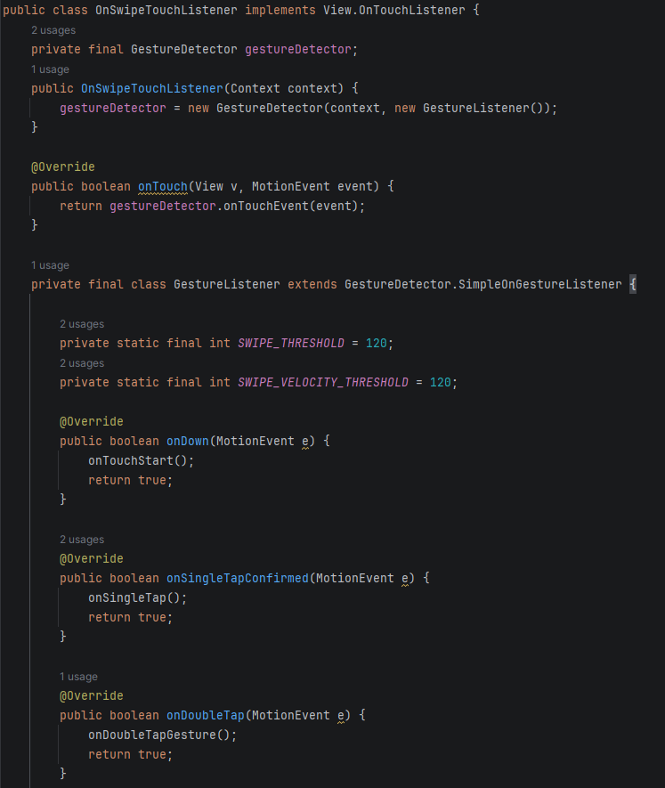

*Рисунок 1. Структура класса OnSwipeTouchListener и слушателя GestureListener*

В классе реализованы методы распознавания жестов: `onFling()` определяет направление свайпа по разнице координат и скорости движения, `onScroll()` — прокрутку, `onLongPress()` — долгое нажатие, `onDoubleTap()` — двойное касание, `onSingleTapConfirmed()` — одиночное касание. Направление свайпа определяется сравнением модулей смещения по осям X и Y.

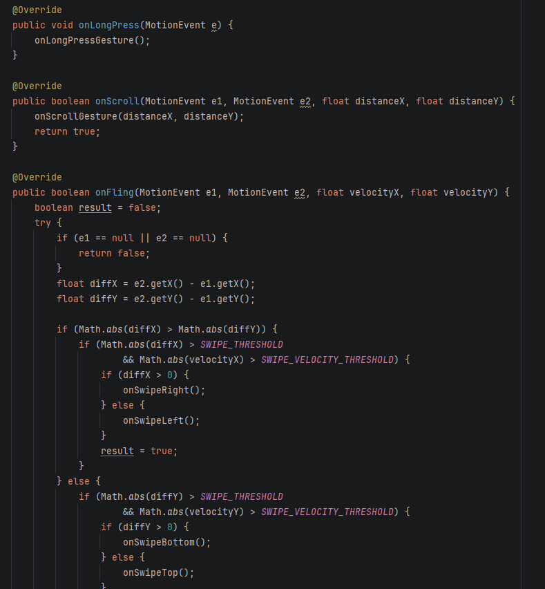

*Рисунок 2. Реализация методов onLongPress, onScroll и onFling*

Для удобства переиспользования логики в классе объявлены пустые методы-«хуки» (`onSwipeRight()`, `onSwipeLeft()`, `onSwipeTop()`, `onSwipeBottom()`, `onSingleTap()`, `onDoubleTapGesture()`, `onLongPressGesture()`, `onScrollGesture()`, `onTouchStart()`), которые переопределяются в месте использования.

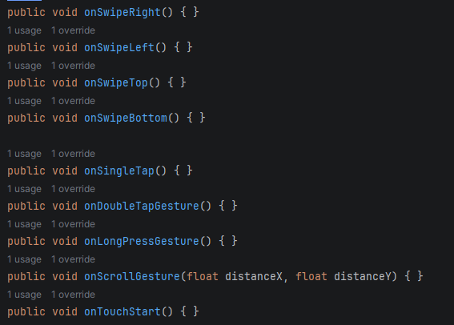

*Рисунок 3. Пустые методы-обработчики, предназначенные для переопределения*

#### 2. Подготовка интерфейса и подключение обработчика (Задания 1 и 3)

В разметке экрана игры `activity_game.xml` клетки игрового поля были оформлены как `androidx.appcompat.widget.AppCompatButton` внутри `GridLayout`. Это потребовалось, потому что в проекте используется тема `Theme.Material3`, при которой обычный тег `<Button>` автоматически заменяется на `MaterialButton`, управляющий своим фоном самостоятельно и игнорирующий программную смену цвета. Использование `AppCompatButton` вернуло полный контроль над фоном клеток.

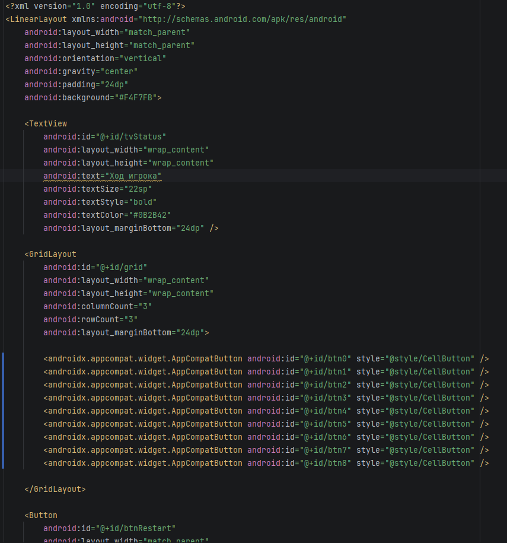

*Рисунок 4. Разметка игрового поля с клетками AppCompatButton*

В классе `GameActivity` объявлены поля состояния: индекс подсвеченной клетки-курсора `selectedIndex`, накопители для распознавания прокрутки и константы визуального оформления (цвета, масштаб, высота «приподнимания»).

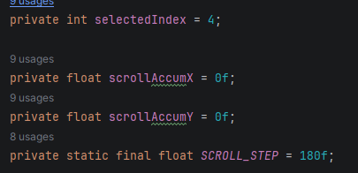

*Рисунок 5. Поле курсора и накопители прокрутки*

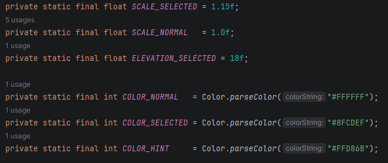

*Рисунок 6. Константы масштаба, высоты и цветов клеток*

В методе `onCreate()` кнопки-клетки делаются некликабельными (`setClickable(false)`), чтобы сенсорные события доходили до `GridLayout`, на который и устанавливается обработчик жестов.

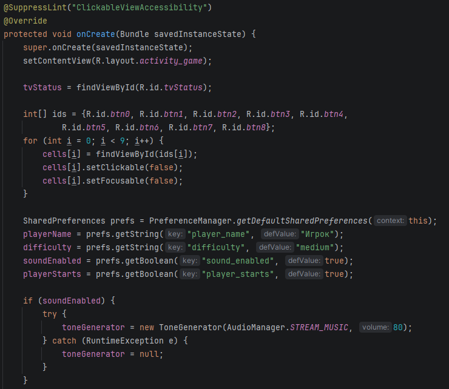

*Рисунок 7. Инициализация клеток и чтение настроек*

Обработчик `OnSwipeTouchListener` устанавливается на игровое поле с анонимной реализацией методов: свайпы перемещают курсор, одиночное касание ставит крестик, двойное касание начинает новую игру, долгое нажатие показывает подсказку, прокрутка плавно двигает курсор.

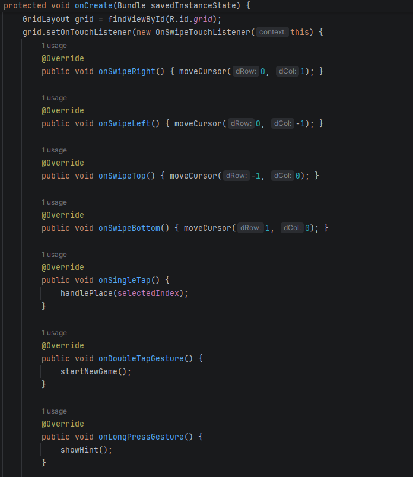

*Рисунок 8. Установка OnSwipeTouchListener: свайпы, касание, двойное касание*

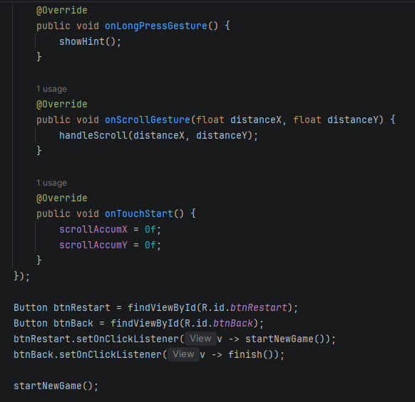

*Рисунок 9. Обработка долгого нажатия, прокрутки и сброс накопителей*

#### 3. Логика управления жестами

Метод `moveCursor()` перемещает выделенную клетку по полю 3×3 с «зажимом» координат в границах поля, а `handleScroll()` накапливает путь пальца и переходит на соседнюю клетку при превышении порога `SCROLL_STEP`.

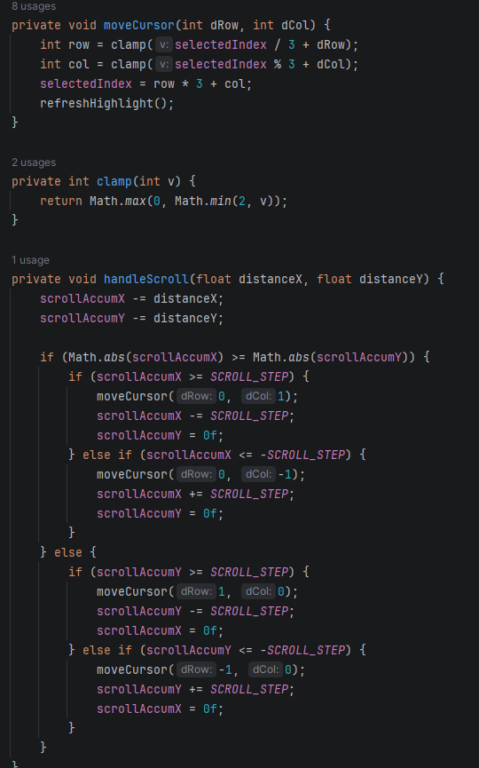

*Рисунок 10. Методы moveCursor, clamp и handleScroll*

Метод `handlePlace()` ставит крестик в выбранную клетку и передаёт ход компьютеру, а `showHint()` подсвечивает рекомендуемый ход.

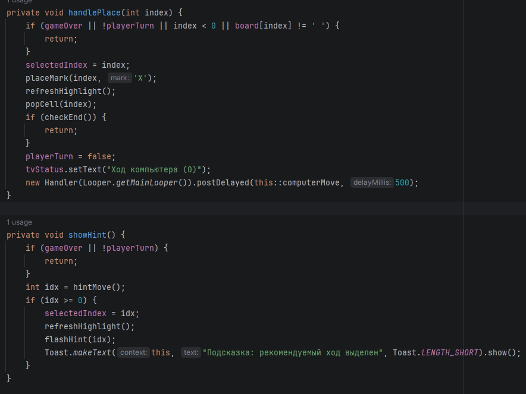

*Рисунок 11. Методы handlePlace и showHint*

Метод `hintMove()` вычисляет лучший ход игрока: проверяет возможность выигрыша, затем необходимость блокировки, далее предпочитает центр и углы.

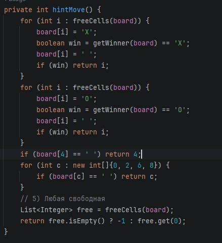

*Рисунок 12. Метод hintMove — выбор рекомендуемого хода*

#### 4. Визуальная обратная связь (Часть 3)

Метод `refreshHighlight()` выделяет текущую клетку цветом, увеличивает её масштаб и «приподнимает» с тенью; `popCell()` даёт эффект «хлопка» при постановке знака; `flashHint()` мигает клеткой жёлтым цветом при показе подсказки. Анимация выполнена через `ViewPropertyAnimator` (`animate()`).

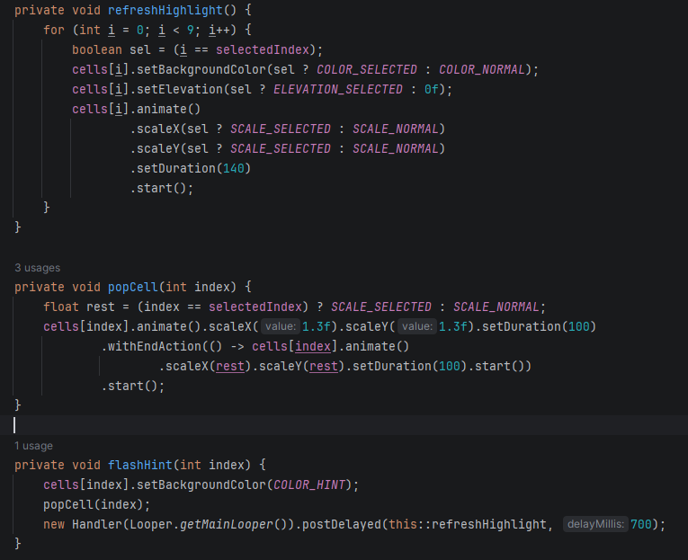

*Рисунок 13. Методы refreshHighlight, popCell и flashHint*

#### 5. Результат работы приложения

После запуска приложения выделенная клетка-курсор подсвечивается голубым цветом и увеличивается. Свайпами и прокруткой курсор перемещается по полю, одиночное касание ставит крестик, после чего ход делает компьютер.

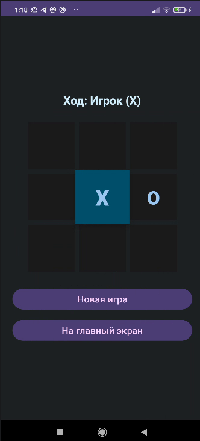

*Рисунок 14. Игровой экран: выделенная клетка-курсор в центре поля*

После свайпа вверх и влево выделение переместилось в верхнюю левую клетку, что подтверждает корректное распознавание направления жеста.

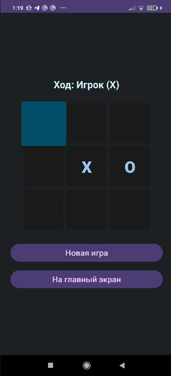

*Рисунок 15. Результат свайпа: курсор переместился в верхнюю левую клетку*

### Вывод

В результате выполнения практической работы я изучил механизмы обработки сенсорных жестов в Android и научился применять класс `GestureDetector` для распознавания сложных движений пальца. Я разработал универсальный класс-обработчик `OnSwipeTouchListener`, реализующий интерфейс `View.OnTouchListener`, и интегрировал его в игру «Крестики-нолики»: свайпы и прокрутка перемещают выделенную клетку, одиночное касание ставит знак, долгое нажатие выводит подсказку, а двойное касание запускает новую игру. Также я добавил визуальную обратную связь (изменение цвета, масштаба и анимацию клеток) и разобрался с особенностью темы Material3, из-за которой обычный `Button` заменяется на `MaterialButton` — задача была решена переходом на `AppCompatButton`. Таким образом, выполнены все три части задания.

### Ответы на контрольные вопросы

1.  **Что такое `MotionEvent`? Какие основные типы событий (actions) в нём существуют?**  
    `MotionEvent` — это объект, описывающий событие сенсорного ввода (касание, движение или отпускание пальца). Он содержит координаты касания (`getX()`, `getY()`), время события, давление, размер области касания и сведения о нескольких точках касания при мультитаче. Основные типы действий: `ACTION_DOWN` (палец коснулся экрана), `ACTION_MOVE` (палец движется), `ACTION_UP` (палец отпущен), `ACTION_CANCEL` (жест прерван системой), а также `ACTION_POINTER_DOWN`/`ACTION_POINTER_UP` для дополнительных пальцев при мультитаче.

2.  **Для чего используется класс `GestureDetector`? В чём его преимущество перед обработкой сырых `MotionEvent`?**  
    `GestureDetector` анализирует последовательность сенсорных событий и сам распознаёт типовые жесты (свайп, долгое нажатие, двойное и одиночное касание, прокрутку), вызывая соответствующие методы-колбэки слушателя. Преимущество в том, что разработчику не нужно вручную отслеживать координаты, временные интервалы, скорость и расстояние между событиями `ACTION_DOWN`, `ACTION_MOVE` и `ACTION_UP` — вся эта логика инкапсулирована в классе, что делает код короче, надёжнее и понятнее.

3.  **Какой метод `GestureDetector` отвечает за распознавание быстрого смахивания (свайпа)? Какие параметры он принимает?**  
    За свайп отвечает метод `onFling(MotionEvent e1, MotionEvent e2, float velocityX, float velocityY)`. Параметр `e1` — событие начала жеста (точка касания), `e2` — событие в конце движения, `velocityX` и `velocityY` — скорость движения пальца по осям X и Y в пикселях в секунду. По разнице координат `e2` и `e1` определяется направление, а по скорости — что это именно быстрое смахивание.

4.  **Зачем в методе `onDown()` необходимо возвращать `true`?**  
    Возврат `true` сообщает `GestureDetector`, что событие `ACTION_DOWN` обработано и интересно слушателю. Только в этом случае детектор продолжит передавать последующие события (`onScroll`, `onFling`, `onLongPress` и др.). Если вернуть `false`, цепочка событий прервётся и более сложные жесты (например, свайп) распознаваться не будут.

5.  **Как отличить горизонтальный свайп от вертикального? Какие параметры для этого используются?**  
    Вычисляются смещения по осям: `diffX = e2.getX() - e1.getX()` и `diffY = e2.getY() - e1.getY()`. Если модуль горизонтального смещения больше вертикального (`Math.abs(diffX) > Math.abs(diffY)`) — свайп горизонтальный, иначе вертикальный. Знак смещения задаёт направление: положительный `diffX` — вправо, отрицательный — влево; положительный `diffY` — вниз, отрицательный — вверх.

6.  **Что такое пороговые значения (threshold) и зачем они нужны при распознавании жестов?**  
    Пороговые значения — это минимально допустимые расстояние (`SWIPE_THRESHOLD`) и скорость (`SWIPE_VELOCITY_THRESHOLD`), при превышении которых движение считается осознанным жестом. Они нужны, чтобы отфильтровать случайные мелкие касания, дрожание пальца и непреднамеренные движения, повышая стабильность и точность распознавания. Уменьшение порогов делает реакцию более чувствительной, увеличение — более «строгой».

7.  **Как заставить View реагировать на сенсорные события? Какой слушатель для этого используется?**  
    Нужно установить на View слушатель `View.OnTouchListener` методом `setOnTouchListener()` и переопределить в нём метод `onTouch(View v, MotionEvent event)`, где обрабатываются события касания (или передаются в `GestureDetector`). Альтернативный способ — создать собственный класс-наследник View и переопределить метод `onTouchEvent()`.

8.  **Какие ещё жесты можно распознать с помощью `GestureDetector`? Назовите не менее трёх.**  
    Кроме свайпа (`onFling`), `GestureDetector` распознаёт: долгое нажатие (`onLongPress`), двойное касание (`onDoubleTap`), прокрутку/перетаскивание (`onScroll`), одиночное подтверждённое касание (`onSingleTapConfirmed` или `onSingleTapUp`), а также начало касания (`onShowPress`).
